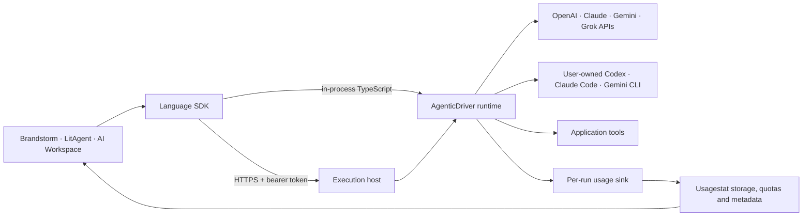

# AgenticDriver SDK

Bring your own agent to your application. Connect to a model API or an installed
agent CLI through one execution contract, in-process or over authenticated HTTPS.

AgenticDriver is an **SDK**. Applications own their data, workflows, tools, user
interface, and approval decisions. The SDK owns provider execution, the API tool
loop, normalized events, cancellation, transport, and usage reporting.

**Status: working v0.1 foundation, not yet published to package registries.**
The TypeScript runtime, four language clients, three application examples, and
integration tests run from this checkout. Provider requests are tested against
protocol fixtures; real paid/account-backed inference has not been certified.

## What works

- API adapters for OpenAI, Anthropic, Gemini, xAI/Grok, and compatible endpoints.
- A [provider extension kit](docs/provider-extensions.md) with pinned host registration, an independent local endpoint example and synthetic compatibility checks.
- Optional [operational diagnostics and OpenTelemetry](docs/diagnostics.md), with content redaction, bounded export and no additional usage backend.
- Text adapters for installed Codex, Claude Code, and Gemini CLI sessions.
- A bounded model/tool/result loop, tool argument validation, host and interactive application approvals,
  validated JSON output, optional inactivity timeouts, and cancellation.
- A Node.js execution host with HTTPS, bearer authentication, provider/tool
  scopes, exact browser-origin allowlists, request limits, and concurrency limits.
- An [installable host CLI](docs/host.md) with `init`, `serve`, `status`, `doctor`,
  and `run`, explicit account/model selection, and separate credential references.
- A [self-hosted container recipe](docs/deployment.md) with a private execution port,
  TLS proxy, Better Auth/AuthYard service authorization and persistent state.
- TypeScript/JavaScript, Python, Go, and Rust clients for discovery, runs, and events.
- [JavaScript and TypeScript package guide](docs/javascript.md) with installed ESM examples, a browser entry, typed errors and cancellation.
- [Refreshable account health and model catalogs](docs/discovery.md), scoped to authorized provider instances and checked without model generation.
- [Usagestat catalog helpers](docs/catalog.md) for provider/account labels, reviewed icons with notices, and explicit quota freshness/fallback displays.
- [Idempotency and recovery](docs/idempotency.md) with optional durable operation records and opt-in retries for safe provider rejections.
- [Detached jobs](docs/jobs.md) with explicit SQLite persistence, tenant-scoped status/cancellation, cursor replay and restart recovery without repeating started work.
- [Selected context and draft artifacts](docs/context.md): bounded text/Markdown,
  explicit image/PDF model support, authorized source references and provenance.
- [Scoped retrieval and vector indexes](docs/retrieval.md): explicit embedding accounts,
  persistent SQLite search, source revision checks and grounded run context in all four clients.
- [PDF, Markdown and email ingestion](docs/ingestion.md): bounded extraction, explicit OCR policy, source provenance, atomic reindexing and separate embedding metering.
- [Account-scoped metering](docs/usage.md) with source, measurement coverage,
  separate API-equivalent estimates and a thin authenticated Usagestat sink. The
  native Usagestat dependency owns storage, retention and offline forwarding, plus account quotas, provider metadata, and existing icon references.



## Try all three examples

Requires Node.js 22.13+ and npm. These examples use deterministic fixtures by default
and require no credentials. The literature and email inputs are explicitly synthetic.

```bash
npm install
npm run check
npm run demo
npx tsx examples/literature-review.ts
npx tsx examples/email-workspace.ts
```

To use a real provider, set `AGENTICDRIVER_PROVIDER` and an explicit
`AGENTICDRIVER_MODEL`. API adapters also require their usual key on the host:
`OPENAI_API_KEY`, `ANTHROPIC_API_KEY`, `GEMINI_API_KEY`, or `XAI_API_KEY`.
CLI adapters use the installed CLI's own sign-in. See [provider setup](docs/providers.md).

```bash
AGENTICDRIVER_PROVIDER=codex AGENTICDRIVER_MODEL=YOUR_MODEL npm run demo
```

## Embed in TypeScript

From an application alongside this repository, build the SDK, then install it:

```bash
# In agenticdriver
npm run build
# In the application
npm install ../agenticdriver
```

```ts
import { AgenticDriver } from "agenticdriver";
import { openai, codex } from "agenticdriver/providers";

const driver = new AgenticDriver({
  providers: [
    openai({ id: "company-api", apiKey: process.env.OPENAI_API_KEY! }),
    codex({ id: "my-codex" }),
  ],
});

const result = await driver.run({
  provider: "my-codex",
  model: "YOUR_MODEL",
  input: "Suggest three names for a sustainable homeware studio.",
  metadata: { app: "brandstorm" },
});
console.log(result.text);
```

Use the optional [Usagestat service dependency](docs/usagestat.md) to capture execution usage in your existing backend. Multiple instances can use the same vendor with separate
keys or explicitly configured CLI account directories.

## Application tools

Functions can also stay in your TypeScript, Python, Go or Rust application while
a local or remote host drives the model loop. The [application tool bridge](docs/application-tools.md)
provides scoped invocation tickets, schema validation, approvals, progress and
result submission. Run `npx tsx examples/application-tools.ts` for a mock example.

API adapters can execute registered application tools. A request must select each
tool by name. The runtime validates all arguments in a batch before executing any
tool, runs them serially, and passes results back to the model. Side-effecting
tools should set `requiresApproval: true` and use a host approval handler or
explicitly enabled [interactive application approvals](docs/approvals.md). All
four clients can review a proposed call and submit a scoped, single-use decision.

```ts
const driver = new AgenticDriver({
  providers: [openai({ apiKey: process.env.OPENAI_API_KEY! })],
  tools: [
    {
      name: "search_passages",
      description: "Search papers accessible to the current user.",
      inputSchema: {
        type: "object",
        properties: { query: { type: "string" } },
        required: ["query"],
        additionalProperties: false,
      },
      execute: async (input, context) => {
        return papers.search(
          context.subject,
          String(input.query),
          context.signal,
        );
      },
    },
  ],
});

await driver.run(
  {
    provider: "openai",
    model: "YOUR_MODEL",
    input: "Find evidence relevant to my review question.",
    tools: ["search_passages"],
    maxSteps: 6,
  },
  { subject: authenticatedUser.id },
);
```

`papers` and `authenticatedUser` are application-owned dependencies. The server
derives `context.subject` from the bearer token, never from request metadata.
Tool implementations remain responsible for resource ownership and respecting
the abort signal; arbitrary in-process JavaScript cannot be forcibly sandboxed.

Hosts can add [fair scheduling and resource policies](docs/scheduling.md) per
subject and account, with opt-in bounded queues and explicit handling of unknown
usage. Quota admission reuses Usagestat; durable accounting remains in that backend.

CLI adapters currently expose text generation only. Supply selected passages,
briefs, or emails as context for those adapters. Unsupported tools fail explicitly.

## Local and remote host

For a configuration-driven installation, use the [host CLI guide](docs/host.md).
It covers local archive installation, secret references, TLS, service setup and
restart recovery.

For application authentication, use [Better Auth with AuthYard](docs/authentication.md):
device consent, short-lived OAuth credentials, revocation and explicit provider/tool
scopes. The SDK uses the application's existing auth runtime and canonical identities.

The following source example is useful when embedding the host:

```bash
export AGENTICDRIVER_TOKEN="$(openssl rand -hex 32)"
npm run demo:server
```

This starts a mock provider on `http://127.0.0.1:7433`. Change the provider/model
environment variables to expose a real adapter. Tokens authenticate to the driver;
provider keys and CLI sessions stay on the execution host.

For a non-loopback listener, provide a certificate and private key:

```bash
export AGENTICDRIVER_HOST=0.0.0.0
export AGENTICDRIVER_TLS_CERT=/path/to/fullchain.pem
export AGENTICDRIVER_TLS_KEY=/path/to/private-key.pem
npm run demo:server
```

Use a trusted certificate matching the hostname clients connect to. Alternatively,
keep the host on loopback behind a TLS reverse proxy. Turn off proxy buffering for
SSE and allow long-lived responses; the SDK sets no total run deadline. HTTP on other hosts is
rejected by every bundled client. Redirects never forward bearer credentials.

```ts
import { AgenticClient } from "agenticdriver/client";

const client = new AgenticClient({
  url: "https://driver.example.com",
  token: process.env.AGENTICDRIVER_TOKEN!,
});

for await (const event of client.stream({
  provider: "mock",
  model: "demo",
  input: "Hello",
})) {
  if (event.type === "text.delta") process.stdout.write(event.text);
  if (event.type === "run.failed" || event.type === "run.cancelled") {
    throw new Error(event.error.message);
  }
}
```

Breaking/closing the stream cancels an unfinished run. `run()` returns the final
result or throws a typed error. `stream()` exposes terminal failure events.
API adapters stream model output as it arrives. Claude Code and Gemini CLI expose
partial text; Codex emits progress and text at the granularity of its JSONL items.
`run.progress` reports model/tool activity without exposing private reasoning.

**No run timer is enabled by default.** Applications can opt into
`idleTimeoutMs` on a run or in host `limits`. A configured timer resets on model
text, reasoning/function-call updates, or actual tool progress. It never limits
total run duration. Network keepalives do not reset it. Long-running tools report
completed work through `context.reportProgress()` and observe `context.signal`.
See [inactivity and cancellation](docs/timeouts.md) for examples and host policy.

## Other languages

All clients use the same [OpenAPI contract](protocol/openapi.json). Any language
with HTTPS and JSON can call the protocol; four language packages are included.

| Language                | Local installation                                                                             | Interface                                                        |
| ----------------------- | ---------------------------------------------------------------------------------------------- | ---------------------------------------------------------------- |
| TypeScript / JavaScript | `npm install ../agenticdriver`                                                                 | `AgenticClient.run()` / `.stream()`                              |
| Python 3.10+            | [Build/install a wheel](clients/python/README.md); add `[async]` for asyncio                   | Typed sync `AgenticClient` and native `AsyncAgenticClient`       |
| Go 1.22+                | [Install a reviewed commit](clients/go/README.md) with `go get`; no local replacement required | `Client.Run(ctx, request)` / `.Stream(ctx, request, callback)`   |
| Rust 1.89+              | [Crate features and installation](clients/rust/README.md)                                      | Async `AsyncAgenticClient` and optional blocking `AgenticClient` |

Python provides synchronous and native asyncio clients. Use `with client.stream`
or `async with client.stream` to close responses on early exit; asyncio task
cancellation also interrupts pending receives. Go supports context cancellation.
Rust provides native async streams: dropping a stream or cancelling a pending
read closes the response. The optional blocking API retains callback cancellation.

```python
from agenticdriver import AgenticClient

with AgenticClient("http://127.0.0.1:7433", token="YOUR_DRIVER_TOKEN") as client:
    print(client.run(provider="mock", model="demo", input="Hello")["text"])
```

For private CAs, Python accepts `ca_file`, Rust accepts `with_ca_pem`, Go accepts
a certificate-verifying transport, and Node supports `NODE_EXTRA_CA_CERTS`.

## Applications and usage

The SDK is integrated into the sibling projects:

- **Brandstorm:** an AgenticDriver provider through Bridge, model discovery,
  structured brainstorming artifacts, normalized events, and cancellation.
- **LitAgent:** optional driver catalog, existing start/interrupt/stop lifecycle,
  normalized research events, and local proposal artifacts.
- **AI Workspace:** mailbox-scoped email triage, summaries, reply drafts, and
  task suggestions, with an offline example and ownership tests.

See [application setup](docs/applications.md), [Usagestat integration](docs/usagestat.md),
and [architecture and boundaries](docs/architecture.md).

## Verification

```bash
npm run check
npm run test:clients   # Node, Python, Go, Rust, and OpenSSL required
npm run test:python    # Installed wheel, sync/async, typing, HTTP and verified HTTPS
npm run test:install   # Packed SDK, JS/TS examples, browser bundle and CLI
npm run test:auth      # Node 24+, real pinned Better Auth + AuthYard contracts
```

The client suite starts temporary hosts and verifies all four clients over HTTP
and HTTPS with certificate verification enabled. Tests cover tool loops, provider
wire formats, signed conversation state, scopes, cancellation, incomplete streams,
usage, and subprocess handling. No live LLM account is needed.

Runs accept explicit `history`, or applications can opt into scoped sessions and
durable jobs. Optional idempotency records reconcile accepted operations without
rerunning effects. Live foreground stream resumption, an outbound device relay
and native MCP tool bridging remain roadmap work. Remote
applications must be able to reach the execution host through HTTPS or an
operator-managed tunnel. Native CLI tooling and subscription access differ by
provider; see the documented [support matrix](docs/providers.md).

## License

MIT. Vendor names and icon references identify their respective providers.

Opt-in [conversation sessions](docs/sessions.md) support explicit continuation, revision checks and deletion. Visible history can be exported; provider state stays bound to its account. Idle retention never limits an active run.
